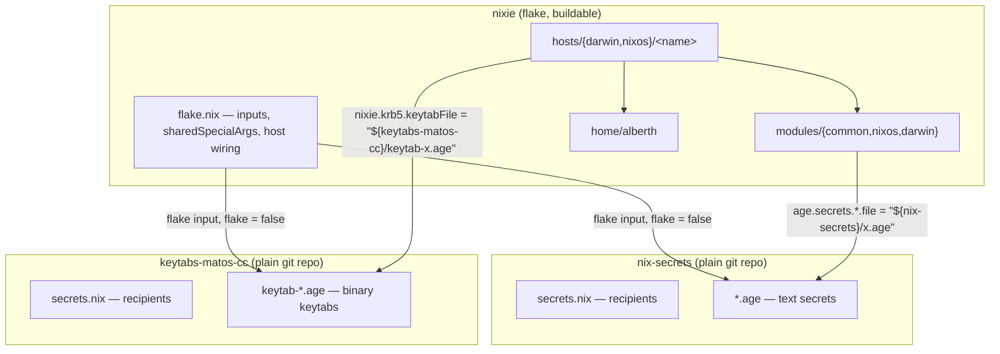
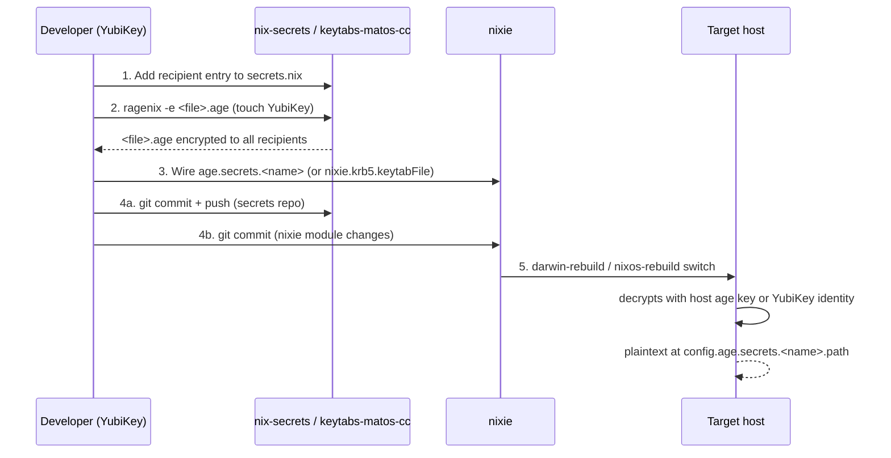

# Architecture

This document explains how `nixie`, `nix-secrets`, and `keytabs-matos-cc` fit together as one
system. It's written for both humans and AI coding agents. Its job is the cross-repo "why" and
"how the pieces connect" — for authoritative, per-repo detail, always defer to that repo's own
`CLAUDE.md` and `README.md` (linked throughout). If this document ever disagrees with a repo's
`CLAUDE.md`, the `CLAUDE.md` wins; treat the discrepancy as a bug in this file.

## 1. System at a glance

Three repositories, each with a single, non-overlapping responsibility:

| Repo | Responsibility | Contents | Is a flake? |
| --- | --- | --- | --- |
| `nixie` | System config for every host (NixOS + darwin) | Nix modules, hosts, home-manager | Yes — top-level flake |
| `nix-secrets` | Age-encrypted **text** secrets (SSH keys, tokens, `.ini` files) | `*.age` files, recipients | No — `flake = false` |
| `keytabs-matos-cc` | Age-encrypted **binary** keytabs for `MATOS.CC` | `keytab-*.age` files, recipients | No — `flake = false` |

`nixie` is the only flake and the only thing that gets built/switched. The other two repos are
pulled in purely as source trees (`flake = false` inputs) so `nixie` can reference `.age` files by
store path; they contain no Nix evaluation logic of their own beyond a `secrets.nix` recipients
list.



## 2. Why three repos, not one

The split is a deliberate security/workflow boundary, not historical accident:

- **`nixie` vs. secrets repos**: system configuration is public-shareable (it's Nix code
  describing *structure*), while secrets are sensitive *values*. Keeping them apart means the
  config repo can be freely inspected, forked, or shared without exposing credentials — only
  encrypted `.age` blobs cross the boundary.
- **`nix-secrets` vs. `keytabs-matos-cc`**: text and binary secrets have fundamentally different
  editing workflows. `nix-secrets` secrets are edited in place with `ragenix -e` (opens `$EDITOR`,
  you type/paste plaintext). Kerberos keytabs are binary artifacts generated by
  `kadmin`/`ktutil`-style tooling — they can't be edited in `$EDITOR`, and git diffs binary files
  poorly (no meaningful diff output, and history bloats fast with each rotation). Splitting them
  into a dedicated repo keeps `nix-secrets` a clean, diffable, plaintext-editing workflow and
  isolates keytab churn.
- **The rule this produces**: *any* new binary secret type — not just keytabs — gets its own
  dedicated repo following the `keytabs-matos-cc` pattern. Never mix binary secrets into
  `nix-secrets`, and never add a new binary secret *type* into `keytabs-matos-cc` (it is
  Kerberos-keytabs-only; see that repo's `CLAUDE.md`).

Both secrets repos otherwise share an identical shape: age/ragenix encryption, a `secrets.nix`
recipients manifest, one or more YubiKey identity stubs (`age-yubikey-identity-*.txt`), and the
same create/wire/commit/rekey workflow — only the payload type differs.

## 3. `nixie` internals

### 3.1 Flake inputs and host wiring

`flake.nix` is the single source of truth for which hosts exist and what they're built from. Key
structure (see `nixie/CLAUDE.md` for the full, current host table — it changes more often than
this document):

- `nix-secrets` and `keytabs-matos-cc` are declared as `flake = false` inputs (plain git repos,
  not flakes) and threaded through `outputs` into `sharedSpecialArgs = { inherit self nix-secrets
  keytabs-matos-cc nvf ...; }`, which every `darwinConfigurations.*` / `nixosConfigurations.*`
  entry receives as `specialArgs`. This is how any module in `nixie` gets a handle on the secrets
  repos' store paths (e.g. `"${nix-secrets}/luadns.ini.age"`).
- `minixie` is the deliberate exception: it's a generic `nixos-anywhere` bootstrap target with no
  identity of its own, and is intentionally **not** given `sharedSpecialArgs` — it never touches
  `nix-secrets` or `keytabs-matos-cc`. It exists only to get a fresh/rescued box to "reachable
  over SSH with disks partitioned"; once up, its host directory is replaced with a real one
  (following the `template-nixos` pattern) rather than extended in place.
- Determinate Nix manages the Nix daemon on every host (`determinate.darwinModules.default` /
  `determinate.nixosModules.default`). This has a real consequence for where settings go — see
  §3.3.

### 3.2 Repository layout and module placement

```text
flake.nix                        # inputs, sharedSpecialArgs, host wiring
users.nix                        # single source of truth for all users

hosts/
  darwin/<name>/default.nix      # host-specific darwin config
  nixos/<name>/default.nix       # host-specific NixOS config

modules/
  common/                        # cross-platform modules (NixOS + darwin)
  nixos/                         # NixOS-only modules
  darwin/                        # darwin-only modules

home/alberth/
  default.nix                    # all shared home config
  <host>.nix                     # per-host home-manager overlay
```

The placement rule agents must follow before adding a module:

1. **Cross-platform logic → `modules/common/`.**
2. **NixOS-only → `modules/nixos/`.** In particular, darwin declares *no* `systemd` option
   namespace at all — gating a `systemd.*` value with `lib.mkIf`/`lib.optionals
   pkgs.stdenv.isLinux` inside a `modules/common/` file is not enough, because the option *key*
   doesn't exist on darwin and evaluation fails regardless of the value. Any `systemd.*` setting
   must live in `modules/nixos/`.
3. **darwin-only → `modules/darwin/`.**
4. **User home config → `home/alberth/`**, with platform-specific divergences isolated to that
   host's overlay file (`home/alberth/<host>.nix`).

`users.nix` is the single source of truth for user data (`primaryUser`, `email`, `gpgSigningKey`)
— never hardcode a username string in a module.

### 3.3 Determinate Nix conf quirk

Because Determinate manages `/etc/nix/nix.conf` itself:

- **NixOS**: plain `nix.settings` works normally — Determinate's NixOS module redirects the
  generated config into `nix.custom.conf` transparently.
- **darwin**: Determinate forces `nix.enable = false`, so nix-darwin never writes
  `/etc/nix/nix.conf` — a plain `nix.settings.trusted-users` entry is silently dropped. Use
  `determinateNix.customSettings` instead.

This is the kind of platform asymmetry an agent should expect throughout `nixie`: the same logical
setting often has two different mechanisms depending on OS, and using the NixOS mechanism on
darwin fails silently rather than erroring.

## 4. Secrets architecture

### 4.1 Shared model (both secrets repos)

Both `nix-secrets` and `keytabs-matos-cc` use identical machinery:

- **Encryption**: [ragenix](https://github.com/yaxitech/ragenix) (a Nix wrapper around
  [age](https://github.com/FiloSottile/age)).
- **Recipients**: declared in each repo's own `secrets.nix`, a plain attribute set mapping
  `"<file>.age".publicKeys` to a list of age public keys. Common recipient groups (`users`,
  `systems`, `ldapHosts`, `syncthingHosts`, ...) are defined once per repo and reused — check for
  an existing group before inventing a new one.
- **Identities**: an offline, non-hardware `alberth` recovery key plus several backup YubiKeys
  (cached touch policy — one touch valid for 15s, PIN required once per session), plus one host
  age key per NixOS/darwin host that needs to decrypt at activation time. Host keys live at
  `/etc/age/host-key`, generated automatically on first activation by `nixie`'s
  `modules/common/age-host-key.nix`.
- **Consumption**: `nixie` never stores a recipient list itself — it only references `.age` file
  paths from the secrets repos via `age.secrets` (or, for keytabs, a dedicated option like
  `nixie.krb5.keytabFile`).

### 4.2 End-to-end lifecycle of a secret



Concretely:

1. **Declare recipients** in the secrets repo's `secrets.nix`.
2. **Encrypt**: `ragenix -e <file>.age` inside that repo (requires the `ragenix` tool, available
   via `nix develop` in `nixie`'s devShell, and a YubiKey touch).
3. **Wire into `nixie`** — add an `age.secrets.<name>` entry (text secrets) or a dedicated option
   like `nixie.krb5.keytabFile` (keytabs) in the appropriate module, referencing
   `"${nix-secrets}/<file>.age"` or `"${keytabs-matos-cc}/keytab-<file>.age"`.
4. **Commit both repos** — the secrets repo and the `nixie` module change that references it, so
   the two never drift.
5. **Rebuild** the host; ragenix decrypts using the host's age key (or the YubiKey identity, for
   manual/local use) and exposes the plaintext at `config.age.secrets.<name>.path`.

### 4.3 Wiring a new secrets repo (if a fourth repo is ever needed)

If a new binary secret *type* requires its own repo (per §2's rule), the pattern to wire it into
`nixie` is:

1. Add it as a `flake = false` input in `flake.nix`.
2. Thread it through the `outputs` function arguments and add it to `sharedSpecialArgs`.
3. Reference files from it as `"${<name>}/<file>"` in the consuming module.
4. Only declare `<name>` in a file's function args if that file actually uses it.
5. Update `hosts/*/template-*` skeleton comments if relevant to future hosts.
6. `nix flake lock --update-input <name>`, then verify with `nix eval
   .#<darwinConfigurations|nixosConfigurations>.<host>.config.<option>` before committing.
7. Update the new repo's own `README.md`/`CLAUDE.md` following the
   `nix-secrets`/`keytabs-matos-cc` pattern.

### 4.4 Rekeying (adding a new host)

When a new host is added to `nixie`, it generates its own age key at `/etc/age/host-key` on first
activation (surfaced in the activation log as "Host age public key (add this to
nix-secrets/secrets.nix and rekey)"). To grant it access to existing secrets:

1. Get the key: `age-keygen -y /etc/age/host-key` on the new host.
2. Add it as a recipient in the relevant secrets repo(s)' `secrets.nix`.
3. `ragenix --rekey` in that repo (touch the YubiKey once per secret file).
4. Commit and push.

This must be repeated independently in `nix-secrets` and `keytabs-matos-cc` if the new host needs
secrets from both.

## 5. Host provisioning paths

`nixie` supports three distinct routes from "fresh machine" to "managed nixie host," chosen by
what access you have:

| Path | Starting point | Mechanism |
| --- | --- | --- |
| `template-nixos` / `template-darwin` | Console access, OS installer already booted | Copy the template host dir, add to `flake.nix`, install manually |
| `ephemeraltron` | Console access, bare metal, nothing installed | Build `.#ephemeraltron-iso`, boot it — self-installs at a fixed IP, offline (pre-baked) |
| `minixie` | SSH-only, no console (VPS/cloud, or rescue boot) | `nixos-anywhere --flake .#minixie root@<ip>` — disko + identity-less install |

`minixie` and `ephemeraltron` are bootstrap scaffolding, not real hosts: once a machine is
reachable, its `hosts/nixos/<name>` directory is replaced with a proper host config (secrets wired
in, `sharedSpecialArgs` included) rather than extended in place.

## 6. Invariants an agent must preserve

These are the load-bearing rules that keep the three-repo system consistent. Violating them
silently breaks the security boundary described in §2, even if the Nix evaluates fine.

1. **Never put a binary secret in `nix-secrets`.** If it's not plaintext/text-editable via
   `ragenix -e` in `$EDITOR`, it belongs in `keytabs-matos-cc` or a new dedicated repo.
2. **Never put a non-keytab secret in `keytabs-matos-cc`.** Even Kerberos-adjacent plaintext
   (e.g. a KDC password) belongs in `nix-secrets`.
3. **`nixie` never contains a recipient list.** Recipients (`secrets.nix`) live only in the
   secrets repos. `nixie` only references file paths.
4. **A `systemd.*` option can only be set from `modules/nixos/`** (or a NixOS-only host file) —
   never gated inside `modules/common/`, even behind a platform conditional.
5. **Every secret-touching commit spans (at least) two repos**: the secrets repo (new/rekeyed
   `.age` file + `secrets.nix`) and `nixie` (the module wiring). Commit both in the same change
   set so they don't drift.
6. **`minixie` stays disconnected from `sharedSpecialArgs`.** Don't "fix" this by adding secrets
   access to it — extend/replace its host directory instead once it's a real host.
7. **Check for an existing recipient group** (`users`, `systems`, `ldapHosts`, `syncthingHosts`,
   ...) in the target secrets repo's `secrets.nix` before inventing a new one.

## 7. Shared conventions across all three repos

All three repos agree on:

- **Commit style**: [Conventional Commits](https://www.conventionalcommits.org/) (`feat:`,
  `fix:`, `chore:`, `docs:`, ...). `nixie` enforces this via commitlint and requires GPG-signed
  commits; the secrets repos follow the same style without automated enforcement.
- **Releases**: CalVer, `yy.mm.release` (e.g. `26.07.01`), counter resets to `01` each new month,
  tags are GPG-signed, changelog entries are combined per release under a heading matching the
  tag.
- **`CHANGELOG.md`**: unreleased changes accumulate under `## Unreleased` until cut into a
  dated/versioned release entry.

Full detail for each lives in that repo's own `CLAUDE.md` — this document intentionally doesn't
restate formatting/commit/release mechanics per repo.

## 8. Document map

Use this document for the cross-repo picture. For anything repo-specific and authoritative, go to:

| Repo | Primary references |
| --- | --- |
| `nixie` | [`CLAUDE.md`](./CLAUDE.md) (directives + conventions), [`README.md`](./README.md) (host table, dev shell, provisioning, feature docs) |
| `nix-secrets` | `nix-secrets/CLAUDE.md`, `nix-secrets/README.md` (recipients + secrets tables) |
| `keytabs-matos-cc` | `keytabs-matos-cc/CLAUDE.md`, `keytabs-matos-cc/README.md` (recipients + secrets tables) |

If you're an AI agent making a change that touches more than one of these repos, re-read the
relevant `CLAUDE.md` files for each repo you're editing before starting — they carry the precise,
current rules; this document only explains how those rules compose across repos.
