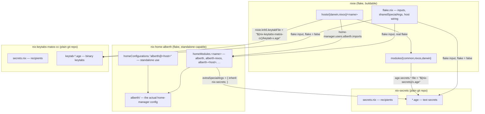
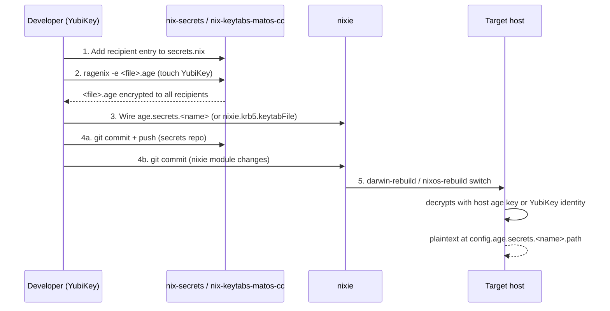

# Architecture

This document explains how `nixie`, `nix-secrets`, `nix-keytabs-matos-cc`, and `nix-home-alberth` fit
together as one system. It's written for both humans and AI coding agents. Its job is the
cross-repo "why" and "how the pieces connect" — for authoritative, per-repo detail, always defer
to that repo's own `CLAUDE.md` and `README.md` (linked throughout). If this document ever
disagrees with a repo's `CLAUDE.md`, the `CLAUDE.md` wins; treat the discrepancy as a bug in this
file.

## 1. System at a glance

Four repositories, each with a single, non-overlapping responsibility:

| Repo | Responsibility | Contents | Is a flake? |
| --- | --- | --- | --- |
| `nixie` | System config for every host (NixOS + darwin) | Nix modules, hosts | Yes — top-level flake |
| `nix-home-alberth` | Home-manager configuration for `alberth` | `alberth/` home-manager modules | Yes — real flake, also independently usable |
| `nix-secrets` | Age-encrypted **text** secrets (SSH keys, tokens, `.ini` files) | `*.age` files, recipients | No — `flake = false` |
| `nix-keytabs-matos-cc` | Age-encrypted **binary** keytabs for `MATOS.CC` | `keytab-*.age` files, recipients | No — `flake = false` |

`nixie` is the only thing that gets built/switched as a system. `nix-secrets` and
`nix-keytabs-matos-cc` are pulled in purely as source trees (`flake = false` inputs) so `nixie` can
reference `.age` files by store path; they contain no Nix evaluation logic of their own beyond a
`secrets.nix` recipients list. `nix-home-alberth` is different from both: it's a real flake (its own
`nixpkgs`/`home-manager`/`nvf`/`qmd`/`stylix`/`nix-secrets` inputs, all `.follows`-pinned to
`nixie`'s) that `nixie` consumes via `homeModules.<name>` outputs — and, unlike the other two, it
also works completely standalone (`home-manager switch --flake`) on any machine with Nix, with or
without `nixie`. The dependency is one-way: `nix-home-alberth` never imports anything from `nixie`.



## 2. Why four repos, not one

Each split is a deliberate security/workflow/reuse boundary, not historical accident:

- **`nixie` vs. secrets repos**: system configuration is public-shareable (it's Nix code
  describing *structure*), while secrets are sensitive *values*. Keeping them apart means the
  config repo can be freely inspected, forked, or shared without exposing credentials — only
  encrypted `.age` blobs cross the boundary.
- **`nix-secrets` vs. `nix-keytabs-matos-cc`**: text and binary secrets have fundamentally different
  editing workflows. `nix-secrets` secrets are edited in place with `ragenix -e` (opens `$EDITOR`,
  you type/paste plaintext). Kerberos keytabs are binary artifacts generated by
  `kadmin`/`ktutil`-style tooling — they can't be edited in `$EDITOR`, and git diffs binary files
  poorly (no meaningful diff output, and history bloats fast with each rotation). Splitting them
  into a dedicated repo keeps `nix-secrets` a clean, diffable, plaintext-editing workflow and
  isolates keytab churn.
- **The rule this produces**: *any* new binary secret type — not just keytabs — gets its own
  dedicated repo following the `nix-keytabs-matos-cc` pattern. Never mix binary secrets into
  `nix-secrets`, and never add a new binary secret *type* into `nix-keytabs-matos-cc` (it is
  Kerberos-keytabs-only; see that repo's `CLAUDE.md`).
- **`nixie` vs. `nix-home-alberth`**: a different motivation than the secrets split — reuse, not
  security. Home-manager configuration (dotfiles, shell, git/gpg identity, per-tool settings) is
  useful independent of any specific NixOS/darwin system, e.g. on a work laptop or an ephemeral
  box that isn't managed by `nixie` at all. Bundling it inside `nixie` would make that impossible
  (home-manager as a NixOS/darwin module can't be evaluated standalone). Splitting it into its own
  real flake, with its own inputs and a local `users.nix` (never importing `nixie`'s), makes both
  modes work from the same source: `nixie` imports `nix-home-alberth.homeModules.<name>`, and anyone
  (including non-`nixie` machines) can run `home-manager switch --flake
  github:amatos/nix-home-alberth#<user>@<host>` directly.

Both secrets repos otherwise share an identical shape: age/ragenix encryption, a `secrets.nix`
recipients manifest, one or more YubiKey identity stubs (`age-yubikey-identity-*.txt`), and the
same create/wire/commit/rekey workflow — only the payload type differs. `nix-home-alberth` shares
none of that shape; it's evaluated Nix code, not `.age` blobs, and is consumed for its exposed
flake outputs rather than referenced by store path.

## 3. `nixie` internals

### 3.1 Flake inputs and host wiring

`flake.nix` is the single source of truth for which hosts exist and what they're built from. Key
structure (see `nixie/CLAUDE.md` for the full, current host table — it changes more often than
this document):

- `nix-secrets` and `nix-keytabs-matos-cc` are declared as `flake = false` inputs (plain git repos,
  not flakes); `nix-home-alberth` is declared as a real flake input, with `inputs.nixpkgs`,
  `.home-manager`, `.nix-secrets`, `.nvf`, `.qmd`, and `.stylix` all `.follows`-pinned to `nixie`'s
  own, so both repos evaluate against the exact same dependency versions. All three are threaded
  through `outputs` into `sharedSpecialArgs = { inherit self nix-secrets nix-keytabs-matos-cc nvf
  nix-home-alberth ...; }`, which every `darwinConfigurations.*` / `nixosConfigurations.*` entry
  receives as `specialArgs`. This is how any module in `nixie` gets a handle on the secrets repos'
  store paths (e.g. `"${nix-secrets}/luadns.ini.age"`) or on `nix-home-alberth`'s exposed
  `homeModules.<name>` outputs.
- `minixie` is the deliberate exception: it's a generic `nixos-anywhere` bootstrap target with no
  identity of its own, and is intentionally **not** given `sharedSpecialArgs` — it never touches
  `nix-secrets` or `nix-keytabs-matos-cc`. It exists only to get a fresh/rescued box to "reachable
  over SSH with disks partitioned"; once up, its host directory is replaced with a real one
  (following the `template-nixos` pattern) rather than extended in place.
- Determinate Nix manages the Nix daemon on every host (`determinate.darwinModules.default` /
  `determinate.nixosModules.default`). This has a real consequence for where settings go — see
  §3.3.

### 3.2 Repository layout and module placement

```text
flake.nix                        # inputs, sharedSpecialArgs, host wiring
users.nix                        # single source of truth for all users

hosts/
  darwin/<name>/default.nix      # host-specific darwin config
  nixos/<name>/default.nix       # host-specific NixOS config

modules/
  common/                        # cross-platform modules (NixOS + darwin)
  nixos/                         # NixOS-only modules
  darwin/                        # darwin-only modules
```

Home-manager configuration (base config + per-host overlays) is **not** in this repo — it's
`nix-home-alberth`'s `alberth/` tree, consumed via `nix-home-alberth.homeModules.<name>` (see that repo's own
`CLAUDE.md` for its layout).

The placement rule agents must follow before adding a module:

1. **Cross-platform logic → `modules/common/`.**
2. **NixOS-only → `modules/nixos/`.** In particular, darwin declares *no* `systemd` option
   namespace at all — gating a `systemd.*` value with `lib.mkIf`/`lib.optionals
   pkgs.stdenv.isLinux` inside a `modules/common/` file is not enough, because the option *key*
   doesn't exist on darwin and evaluation fails regardless of the value. Any `systemd.*` setting
   must live in `modules/nixos/`.
3. **darwin-only → `modules/darwin/`.**
4. **User home config → the `nix-home-alberth` repo, not this one** (`alberth/` there), with
   platform-specific divergences isolated to that host's overlay file (`alberth/<host>.nix`).

`nixie`'s own `users.nix` is the single source of truth for *its* user data (`primaryUser`,
system account fields, plus `email` for certbot's Let's Encrypt registration) — never
hardcode a username string in a module. `nix-home-alberth` has its own, separate `users.nix`
(`description`/`email`/`gpgSigningKey`, for git/gpg identity only) — the two are intentionally
not shared; see §2's `nixie` vs. `nix-home-alberth` entry.

### 3.3 Determinate Nix conf quirk

Because Determinate manages `/etc/nix/nix.conf` itself:

- **NixOS**: plain `nix.settings` works normally — Determinate's NixOS module redirects the
  generated config into `nix.custom.conf` transparently.
- **darwin**: Determinate forces `nix.enable = false`, so nix-darwin never writes
  `/etc/nix/nix.conf` — a plain `nix.settings.trusted-users` entry is silently dropped. Use
  `determinateNix.customSettings` instead.

This is the kind of platform asymmetry an agent should expect throughout `nixie`: the same logical
setting often has two different mechanisms depending on OS, and using the NixOS mechanism on
darwin fails silently rather than erroring.

## 4. Secrets architecture

### 4.1 Shared model (both secrets repos)

Both `nix-secrets` and `nix-keytabs-matos-cc` use identical machinery:

- **Encryption**: [ragenix](https://github.com/yaxitech/ragenix) (a Nix wrapper around
  [age](https://github.com/FiloSottile/age)).
- **Recipients**: declared in each repo's own `secrets.nix`, a plain attribute set mapping
  `"<file>.age".publicKeys` to a list of age public keys. Common recipient groups (`users`,
  `systems`, `ldapHosts`, `syncthingHosts`, ...) are defined once per repo and reused — check for
  an existing group before inventing a new one.
- **Identities**: an offline, non-hardware `alberth` recovery key plus several backup YubiKeys
  (cached touch policy — one touch valid for 15s, PIN required once per session), plus one host
  age key per NixOS/darwin host that needs to decrypt at activation time. Host keys live at
  `/etc/age/host-key`, generated automatically on first activation by `nixie`'s
  `modules/common/age-host-key.nix`.
- **Consumption**: `nixie` never stores a recipient list itself — it only references `.age` file
  paths from the secrets repos via `age.secrets` (or, for keytabs, a dedicated option like
  `nixie.krb5.keytabFile`).

### 4.2 End-to-end lifecycle of a secret



Concretely:

1. **Declare recipients** in the secrets repo's `secrets.nix`.
2. **Encrypt**: `ragenix -e <file>.age` inside that repo (requires the `ragenix` tool, available
   via `nix develop` in `nixie`'s devShell, and a YubiKey touch).
3. **Wire into `nixie`** — add an `age.secrets.<name>` entry (text secrets) or a dedicated option
   like `nixie.krb5.keytabFile` (keytabs) in the appropriate module, referencing
   `"${nix-secrets}/<file>.age"` or `"${nix-keytabs-matos-cc}/keytab-<file>.age"`.
4. **Commit both repos** — the secrets repo and the `nixie` module change that references it, so
   the two never drift.
5. **Rebuild** the host; ragenix decrypts using the host's age key (or the YubiKey identity, for
   manual/local use) and exposes the plaintext at `config.age.secrets.<name>.path`.

### 4.3 Wiring a new secrets repo (if a fourth repo is ever needed)

If a new binary secret *type* requires its own repo (per §2's rule), the pattern to wire it into
`nixie` is:

1. Add it as a `flake = false` input in `flake.nix`.
2. Thread it through the `outputs` function arguments and add it to `sharedSpecialArgs`.
3. Reference files from it as `"${<name>}/<file>"` in the consuming module.
4. Only declare `<name>` in a file's function args if that file actually uses it.
5. Update `hosts/*/template-*` skeleton comments if relevant to future hosts.
6. `nix flake lock --update-input <name>`, then verify with `nix eval
   .#<darwinConfigurations|nixosConfigurations>.<host>.config.<option>` before committing.
7. Update the new repo's own `README.md`/`CLAUDE.md` following the
   `nix-secrets`/`nix-keytabs-matos-cc` pattern.

### 4.4 Rekeying (adding a new host)

When a new host is added to `nixie`, it generates its own age key at `/etc/age/host-key` on first
activation (surfaced in the activation log as "Host age public key (add this to
nix-secrets/secrets.nix and rekey)"). To grant it access to existing secrets:

1. Get the key: `age-keygen -y /etc/age/host-key` on the new host.
2. Add it as a recipient in the relevant secrets repo(s)' `secrets.nix`.
3. `ragenix --rekey` in that repo (touch the YubiKey once per secret file).
4. Commit and push.

This must be repeated independently in `nix-secrets` and `nix-keytabs-matos-cc` if the new host needs
secrets from both.

## 5. Host provisioning paths

`nixie` supports two distinct routes from "fresh machine" to "managed nixie host," chosen by
what access you have:

| Path | Starting point | Mechanism |
| --- | --- | --- |
| `template-nixos` / `template-darwin` | Console access, OS installer already booted | Copy the template host dir, add to `flake.nix`, install manually |
| `minixie` | SSH-only, no console (VPS/cloud, or rescue boot) | `nixos-anywhere --flake .#minixie root@<ip>` — disko + identity-less install |

`minixie` is bootstrap scaffolding, not a real host: once a machine is reachable, its
`hosts/nixos/<name>` directory is replaced with a proper host config (secrets wired in,
`sharedSpecialArgs` included) rather than extended in place. `ephemeraltron` and `darwintron` are
CI build targets, not provisioning paths — see `CLAUDE.md`'s Hosts table for their role.

## 6. Invariants an agent must preserve

These are the load-bearing rules that keep the four-repo system consistent. Violating them
silently breaks the security/reuse boundaries described in §2, even if the Nix evaluates fine.

1. **Never put a binary secret in `nix-secrets`.** If it's not plaintext/text-editable via
   `ragenix -e` in `$EDITOR`, it belongs in `nix-keytabs-matos-cc` or a new dedicated repo.
2. **Never put a non-keytab secret in `nix-keytabs-matos-cc`.** Even Kerberos-adjacent plaintext
   (e.g. a KDC password) belongs in `nix-secrets`.
3. **`nixie` never contains a recipient list.** Recipients (`secrets.nix`) live only in the
   secrets repos. `nixie` only references file paths.
4. **A `systemd.*` option can only be set from `modules/nixos/`** (or a NixOS-only host file) —
   never gated inside `modules/common/`, even behind a platform conditional.
5. **Every secret-touching commit spans (at least) two repos**: the secrets repo (new/rekeyed
   `.age` file + `secrets.nix`) and `nixie` (the module wiring). Commit both in the same change
   set so they don't drift.
6. **`minixie` stays disconnected from `sharedSpecialArgs`.** Don't "fix" this by adding secrets
   access to it — extend/replace its host directory instead once it's a real host.
7. **Check for an existing recipient group** (`users`, `systems`, `ldapHosts`, `syncthingHosts`,
   ...) in the target secrets repo's `secrets.nix` before inventing a new one.
8. **`nix-home-alberth` never imports from `nixie`.** No relative-path import crossing the repo
   boundary (the pre-migration bug this replaced), no shared `users.nix`. If a `nix-home-alberth`
   module needs data only `nixie` has, thread it through `extraSpecialArgs` from `nixie` (the
   consuming side), never by reaching backward from `nix-home-alberth`.
9. **A new `nix-home-alberth` host overlay must be committed and pushed to `nix-home-alberth` first**,
   then picked up in `nixie` via `nix flake lock --update-input nix-home-alberth` — there is no way to
   reference an uncommitted `nix-home-alberth` file from `nixie`.

## 7. Shared conventions across all four repos

All four repos agree on:

- **Commit style**: [Conventional Commits](https://www.conventionalcommits.org/) (`feat:`,
  `fix:`, `chore:`, `docs:`, ...). All four repos enforce this via the same commitlint hook
  (each has its own `flake.nix`/`.commitlintrc.yaml`, installed via `nix develop`). All four
  repos require every commit and every tag to be GPG-signed — see each repo's own `CLAUDE.md`.
- **Releases**: CalVer, `yy.mm.release` (e.g. `26.07.01`), counter resets to `01` each new month,
  tags are GPG-signed, changelog entries are combined per release under a heading matching the
  tag.
- **`CHANGELOG.md`**: unreleased changes accumulate under `## Unreleased` until cut into a
  dated/versioned release entry.

Full detail for each lives in that repo's own `CLAUDE.md` — this document intentionally doesn't
restate formatting/commit/release mechanics per repo.

## 8. Document map

Use this document for the cross-repo picture. For anything repo-specific and authoritative, go to:

| Repo | Primary references |
| --- | --- |
| `nixie` | [`CLAUDE.md`](./CLAUDE.md) (directives + conventions), [`README.md`](./README.md) (host table, dev shell, provisioning, feature docs) |
| `nix-secrets` | `nix-secrets/CLAUDE.md`, `nix-secrets/README.md` (recipients + secrets tables) |
| `nix-keytabs-matos-cc` | `nix-keytabs-matos-cc/CLAUDE.md`, `nix-keytabs-matos-cc/README.md` (recipients + secrets tables) |
| `nix-home-alberth` | `nix-home-alberth/CLAUDE.md`, `nix-home-alberth/README.md` (`alberth/` layout, `homeModules`/`homeConfigurations`, standalone usage) |

If you're an AI agent making a change that touches more than one of these repos, re-read the
relevant `CLAUDE.md` files for each repo you're editing before starting — they carry the precise,
current rules; this document only explains how those rules compose across repos.

## 9. Latest releases

| Repo | Latest release |
| --- | --- |
| `nixie` | `26.07.18` |
| `nix-home-alberth` | `26.07.05` |
| `nix-secrets` | `26.07.07` |
| `nix-keytabs-matos-cc` | `26.07.05` |

Kept in sync manually — update this table whenever any of the four repos cuts a new release (see
`CLAUDE.md` "Before making changes").

## 10. Active migration: porkchop service realignment

**Goal**: move Kerberos+LDAP from `porkchop` to `muninn`, remove SMB from `porkchop`, make
`huginn` the primary SMTP smarthost with `porkchop` as backup (`mail.home.matos.cc` /
`mail-backup.home.matos.cc`), and stand up a centralized syslog server + log-review stack on
`porkchop`.

**How to use this checklist**: each stage below is a single atomic unit of work — implement it,
validate it against its own criteria, then check it off (`- [ ]` → `- [x]`) before starting the
next one. Stages may be executed days or weeks apart, possibly picked up in a session with no
memory of the discussion that produced this plan — every entry is written to stand on its own,
with exact files/values, so it doesn't depend on conversational context. Update this checklist
in the same commit as the change it describes so it never drifts from reality.

### Stage 0 — Prerequisites

- [x] `nix-secrets/secrets.nix`: `smtpSmartRelays = [ porkchop ];` group added, `smtp-relay-sasl.age`
      re-scoped to `users ++ smtpSmartRelays` (was `users ++ systems`). Rekeyed (`ragenix
      --rekey`) and committed in `nix-secrets` as `1430182`. `huginn` still needs adding to
      `smtpSmartRelays` (and another rekey) in Stage 5.
- [x] Confirmed UniFi Integration API access at `10.0.4.1` using `nix-secrets/unifi/api-key.age`
      (`GET /proxy/network/integration/v1/sites` → HTTP 200, returned the "Default" site).

### Stage 1 — Remove SMB from porkchop

- [x] In `hosts/nixos/porkchop/default.nix`: removed the `services.samba` block,
      `services.samba-wsdd.enable`, and the firewall `extraInputRules` lines for 445/139 tcp and
      137/138 udp and 3702 udp. Left the 88/464/749 (Kerberos) rules in place — the KDC is still
      on porkchop until Stage 4. Committed as `444146b` (+ changelog `de71829`).
- [x] **Validated**: switched on porkchop directly (this darwin machine has no Linux builder, so
      the build/switch had to run on/against porkchop itself). Confirmed over SSH:
      `samba-smbd`/`samba-nmbd`/`samba-wsdd` systemd units no longer exist, no listener on
      445/139/137/138/3702, and 88/464/749 (Kerberos) still listening as expected.

### Stage 2 — Stand up Kerberos+LDAP on muninn (additive; porkchop stays authoritative)

- [x] `nix-keytabs-matos-cc/secrets.nix`: added the `muninn` age public key entry (was missing
      entirely — a pre-existing gap, unrelated to this migration), plus recipient blocks for two
      new keytab files: `keytab-muninn.age` (host keytab, `host/muninn.matos.cc`) and
      `keytab-ldap-muninn.age` (SASL/GSSAPI `ldap/` service principal keytab). Committed as
      `1c00bf7`.
- [x] Generated `host/muninn.matos.cc` and `ldap/muninn.ts.matos.cc` principals via `kadmin`
      against the live porkchop KDC, extracted keytabs, and encrypted each with `rage` against
      the `users ++ [ muninn ]` recipients from `secrets.nix` (verified: 8 real recipient
      stanzas each — 1 X25519 recovery key, 6 piv-p256 YubiKeys, 1 X25519 muninn host key).
      Committed as `8352fbf` in `nix-keytabs-matos-cc`.
- [x] `nix-secrets/secrets.nix`: split `unifiBackupHosts = [ porkchop ];` out of `ldapHosts` (so
      `unifi/backup-ssh-key.age` keeps porkchop's access independent of the LDAP move); set
      `ldapHosts = [ porkchop muninn ];` for the transition window. Committed as `abfd9df`,
      rekeyed and committed as `d4f81e8`.
- [x] `flake.nix`: added `nix-kerberos-ldap.nixosModules.default` to muninn's
      `nixosConfigurations.muninn.modules`.
- [x] `hosts/nixos/muninn/default.nix`: mirrored porkchop's `services.kerberosLdap` block, TLS via
      `nixie.certbot.ldapDeploy = true`, and firewall rules opening 389 and 636 to `10.0.4.0/22`
      **(LAN-reachable, per explicit decision — unlike porkchop's current Tailscale-only LDAP
      exposure)**, alongside 88/464/749 tcp+udp matching porkchop's existing pattern. Built and
      switched directly on muninn (this darwin machine has no Linux builder). `saslHost` was
      later removed — see the GSSAPI bug note below.
- [x] **Manual data migration**: `slapcat`/`slapadd` on the full `dc=matos,dc=cc` suffix (which
      includes the `cn=kerberos` subtree — this realm's KDC is LDAP-backed via `kdb5_ldap_util`,
      not the Berkeley-DB backend, so a single LDAP dump/load migrates both directory and
      Kerberos principal data; no separate `kdb5_util dump`/`load` needed). Required two
      `nix-kerberos-ldap` module fixes discovered along the way, both committed as `4c4e0e5`:
      (1) `systemd.services.openldap` had no `after`/`wants = [ "agenix.service" ]`, so its
      one-time `cn=config` bootstrap could race agenix at boot and permanently corrupt
      `slapd.d` (hit on muninn's first activation — fixed by wiping `slapd.d` and letting it
      re-init once agenix had already run); (2) the master key (`ldap/krb5-master-key.age`) and
      `kadm5.acl`/local KDC stash-file locations needed manual reconciliation against porkchop's
      actual live files, since those secrets/paths had never been exercised on a second host
      before. Validated via `kinit -k -t /etc/krb5.keytab host/muninn.matos.cc` succeeding
      end-to-end (KDC → LDAP backend → master key, all working).
- [x] **Validate**: `kinit`/`ldapwhoami` against muninn directly, confirmed working — see the
      GSSAPI bug entry immediately below, which this validation step surfaced and which is now
      fixed on both porkchop and muninn.

**Bug found and fixed during this stage's validation** (pre-existing, affects both hosts, not
introduced by this migration): the realm's GSSAPI/SASL LDAP bind (`ldapwhoami -Y GSSAPI` and
similar) had apparently never been exercised end-to-end before. Two independent problems, both
now fixed on porkchop and muninn:

1. Cyrus SASL's GSSAPI client plugin builds its target service principal from the *peer's
   reverse-DNS name*, not the URL/hostname used to connect. Tailscale's own PTR records always
   answer with the tailnet's native `<host>.tail2269e5.ts.net` name, never the custom
   `ts.matos.cc` alias — regardless of `ldap.conf`'s `SASL_NOCANON` or `krb5.conf`'s
   `rdns`/`dns_canonicalize_hostname` (neither setting reaches this codepath). Every real client
   was therefore requesting a ticket for a principal that didn't exist, and `olcSaslHost` being
   set to the `ts.matos.cc` name meant slapd rejected it outright even after the correct
   principal was added (only tried the one matching keytab entry). Fixed by: adding an
   `ldap/<host>.tail2269e5.ts.net@MATOS.CC` alias principal to each host's KDC and SASL keytab
   (nixie commit `101248e`, keytabs regenerated in `nix-keytabs-matos-cc` commit `27fbc23`), and
   removing `saslHost` entirely from both hosts' Nix config so slapd accepts any keytab
   principal rather than one hardcoded hostname.
2. `saslAuthzRegexp` expected a 4-component SASL identity
   (`uid=.../cn=<realm>/cn=gssapi/cn=auth`), but this cyrus-sasl/krb5 version produces only 3
   (`uid=.../cn=gssapi/cn=auth`) — no realm component — so the regex never matched and
   `ldapwhoami` returned the raw SASL DN instead of the mapped `cn=admin,dc=matos,dc=cc`. Fixed
   in the same nixie commit (`101248e`).

Both fixes were applied live via `ldapmodify -Y EXTERNAL` on each host's already-running
`cn=config` (required since `mutableConfig = true` means a rebuild/switch alone never touches
an already-initialized `slapd.d`) and verified end-to-end: `kinit alberth` +
`ldapwhoami -H ldap://<host>.ts.matos.cc/ -Y GSSAPI` now correctly returns
`dn:cn=admin,dc=matos,dc=cc` on both porkchop and muninn.

### Stage 3 — Cut fleet-wide realm pointer to muninn

- [x] `modules/common/krb5-client.nix`: changed both `kdc` and `admin_server` from
      `porkchop.ts.matos.cc` to `muninn.ts.matos.cc`. Consumed fleet-wide by every host, NixOS
      and darwin alike (via `common-nixos.nix`/`common-darwin.nix`) — the single
      highest-blast-radius line in this migration. Committed as `e40b8d8`. Confirmed via `nix
      eval` that porkchop and muninn are unaffected (both keep `kdc = localhost` from their own
      higher-priority server-side config).
- [x] **Validated**: switched `huginn`, `gammu`, and `codex` onto the new config and confirmed
      `kinit` succeeds against muninn from each. Porkchop's KDC/LDAP remained fully live
      throughout this stage.

### Stage 4 — Decommission Kerberos+LDAP on porkchop

- [x] Removed `services.kerberosLdap`, the `nix-kerberos-ldap` module import, `ldapDeploy`, the
      88/464/749 firewall rules, and the now-unused `krb5WithLdap`/`pkgs` argument from
      `hosts/nixos/porkchop/default.nix` and `flake.nix`. Kept `keytab-porkchop.age` (porkchop's
      own client keytab — unrelated to serving the realm). Committed as `c826991`.
- [x] `nix-secrets/secrets.nix`: shrank `ldapHosts` to `[ muninn ];`. Committed as `179905d`,
      rekeyed and committed as `ea3fa8e` (revokes porkchop's decrypt access to the three
      `ldap/*.age` secrets).
- [x] Archived porkchop's old LDAP/KDC data (`tar czf` of `/var/lib/openldap` +
      `/var/lib/krb5kdc`). **Executed 2026-07-21 — delete on or after 2026-07-28.**
- [x] **Validated**: switched porkchop; `openldap`/`kdc`/`kadmind` units confirmed gone
      (`systemctl status` → "could not be found" for all three); `kinit alberth` on porkchop
      itself now correctly obtains a ticket from muninn (`klist` shows
      `krbtgt/MATOS.CC@MATOS.CC`, no local KDC involved).
- [x] **Follow-up fix discovered during validation**: porkchop's `kinit`/`klist`/`kdestroy` were
      briefly missing entirely after the switch — `nix-home-alberth`'s `alberth/nixos.nix`
      excluded `pkgs.krb5` specifically on porkchop (to avoid shadowing the LDAP-enabled
      `krb5WithLdap` system build that no longer exists there). Fixed by removing that
      exclusion — `nix-home-alberth` commit `ce959a6`, `nixie` flake.lock bump `28bf135`.

### Stage 5 — Stand up huginn as primary SMTP relay (additive)

- [x] `hosts/nixos/huginn/default.nix`: imported `modules/nixos/smtp-relay.nix` and
      `modules/common/smtp-relay-secrets.nix`; set `nixie.smtpRelay.enable = true` and
      `smtps.enable = true`. Committed as `3b5c6aa` (also fixed a build-blocking conflict this
      surfaced — `common-nixos.nix`'s client postfix guard only excluded porkchop, colliding
      with huginn's new server config; generalized to exclude both).
- [x] Added `huginn` to `smtpSmartRelays` in `nix-secrets/secrets.nix`. Committed as `a87dad7`,
      rekeyed and committed as `70fa0cc`.
- [x] Certbot: added the `mail.home.matos.cc`/`mail.ts.matos.cc` domain group to huginn's
      `nixie.certbot.domains` with `postfixDeploy = true`.
- [x] Firewall: opened 25/465 to `10.0.4.0/22` on huginn, matching porkchop's existing rule.
- [x] **Validated**: sent a real test email routed directly through huginn via `mailutils`;
      confirmed delivered. Surfaced and fixed two real Postfix bugs along the way, both
      applying to porkchop too (commits `1d39bf2`, `3944826`, `0b246cb`): (1) `myhostname` was
      left at the bare hostname, fixed by setting it to the LAN FQDN; (2) mail clients that
      construct their own From address via `gethostname()` (e.g. `mailutils`' `mail`) produced
      a syntactically complete but short-hostname address that `myorigin` never rewrites —
      Fastmail rejected it outright ("need fully-qualified address"). Fixed with an
      `smtp_generic_maps` table rewriting the bare-hostname domain at the Postfix SMTP client.
      That table's file had to be placed at a top-level `/etc/postfix-generic-map` rather than
      under `/etc/postfix/` — the latter is a runtime bind-mount NixOS's postfix module manages
      as a whole unit, so `environment.etc` can't inject an individual file into it (a real
      build failure hit and fixed mid-stage, same reasoning as the existing SASL map's
      `/run/agenix` path).

### Stage 6 — Cut fleet SMTP client config to huginn-primary + porkchop-fallback

- [x] `hosts/nixos/common-nixos.nix`: changed the client `postfix.settings.main.relayhost` from
      `[porkchop.ts.matos.cc]:25` to `[huginn.ts.matos.cc]:25`; added
      `smtp_fallback_relay = ["[porkchop.ts.matos.cc]:25"]`. (The postfix-client guard was
      already generalized to exclude both `huginn` and `porkchop` back in Stage 5 — that turned
      out to be a hard build prerequisite there, not something deferrable to this stage.) The
      chrony client guard is unaffected — stays porkchop-specific. Committed as `66db524`.
- [x] Updated porkchop's cert domain list in `hosts/nixos/porkchop/default.nix`: swapped
      `mail.home.matos.cc`/`mail.ts.matos.cc` for `mail-backup.home.matos.cc`/
      `mail-backup.ts.matos.cc`. Same commit.
- [x] **Validated from gammu**: normal delivery via huginn confirmed, then `postfix.service`
      stopped on huginn and fallback delivery via porkchop confirmed too.
- [x] **Follow-up fix discovered during validation**: the same bare-hostname-sender bug from
      Stage 5 also affected every plain client host, not just huginn/porkchop — gammu's local
      postfix forwarded `alberth@gammu` to huginn unchanged, and Fastmail rejected it. Applied
      the identical `myhostname`/`smtp_generic_maps` fix to the fleet-wide client config in
      `common-nixos.nix`. Committed as `d456368`.

### Stage 7 — Centralized syslog server on porkchop

Independent of Stages 1–6; can be done in parallel at any point. Recommended stack: `rsyslog`
(receiver) + Grafana Loki + Promtail (review UI) — chosen over Graylog (needs
OpenSearch/Elasticsearch + MongoDB, not packaged in nixpkgs) or full ELK; `lnav` is a
lower-effort CLI-only fallback if the full stack isn't wanted.

- [x] **7a**: new `modules/nixos/syslog-server.nix` (imported only by porkchop) —
      `services.rsyslogd` listening on UDP+TCP 514, firewalled to `10.0.4.0/22` + Tailscale.
      Systemd unit is named `syslog.service`, not `rsyslog.service` (a NixOS module naming
      quirk hit during validation). Committed as `caa6e00`. **Validated**: sent a test message
      from huginn via `logger`, confirmed it landed at
      `/var/log/remote/huginn/alberth.log` with correct timestamp/hostname/tag.
- [x] **7b**: added `services.loki` + `services.grafana` on porkchop, gated by an independently
      toggleable `nixie.syslogServer.grafana.enable` in `modules/nixos/syslog-server.nix`.
      Required a new `grafana-secret-key.age` secret (NixOS 26.05's Grafana module has no
      default `secret_key` anymore) — `nix-secrets` commit `dd944c0`, scoped to a new
      `grafanaHosts = [ porkchop ]` group. Grafana is Tailscale-only (not opened on the LAN
      firewall — a log-browsing dashboard is more sensitive than the receiver ports).
      Committed as `dd77f34` (+ `flake.lock` bump `dbcc941`). **Validated**: Grafana reachable
      at `porkchop.ts.matos.cc:3000`, a manually-pushed Loki log line queried successfully via
      Explore.
- [ ] **7c**: add `services.promtail` on porkchop, tailing the rsyslog output files (or journald)
      into Loki. Validate: one real host's logs appear end-to-end in Grafana.
- [ ] **7d**: roll fleet-wide log forwarding out via a `common-nixos.nix` default (mirroring the
      postfix-client-default pattern), one host at a time. Validate each host's logs appear in
      Grafana before moving to the next.

### Stage 8 — UniFi internal DNS CNAMEs

- [x] Added via UniFi's Local DNS Records API (`/proxy/network/v2/api/site/default/static-dns`,
      not the Integration API used for the earlier access check — a separate endpoint on the
      same controller): `mail.home.matos.cc` CNAME → `huginn.home.matos.cc`, and
      `mail-backup.home.matos.cc` CNAME → `porkchop.home.matos.cc`, matching the existing
      `smtp.home.matos.cc` → `porkchop.home.matos.cc` CNAME-to-hostname convention already in
      use there.
- [x] **Validated**: `getent hosts mail.home.matos.cc mail-backup.home.matos.cc` from porkchop
      resolves both to the correct LAN IPs (huginn's and porkchop's respectively).

**Cleanup**: a pre-existing `home.matos.cc` MX record pointing at `smtp.home.matos.cc` (CNAME to
`porkchop.home.matos.cc`) was found during this stage — vestigial and already non-functional,
since neither huginn's nor porkchop's Postfix accepts inbound delivery
(`local_transport = "error:local delivery disabled"` on both). Removed both records at the
user's request; confirmed gone via the UniFi API.
